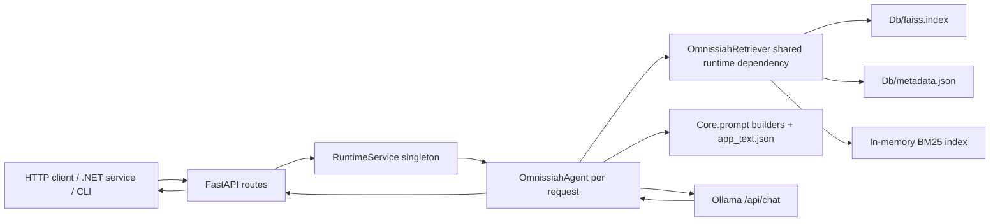

# Executive Overview

## What The Application Does

OmnissiahCore is a local Retrieval-Augmented Generation service for querying a large lore archive. The application accepts natural-language questions, retrieves relevant archive chunks from a FAISS vector index and optional BM25 keyword index, stitches neighbouring chunks for narrative continuity, builds a mode-specific prompt, and sends the grounded context to a locally running Ollama chat model.

The production entry points are:

- `main.py:16` defines the supported process modes: `cli`, `api`, `verify`, and `build`.
- `main.py:41` starts the API mode by replacing the current Python process with `uvicorn Api.server:app --host 0.0.0.0 --port 8000 --reload`.
- `Api/server.py:25` creates the FastAPI application, middleware, startup hook, and routers.
- `Api/services/runtime_service.py:33` owns the runtime singleton used by all API routes.
- `Core/retriever.py:56` implements the hybrid retrieval engine.
- `Core/agent.py:28` orchestrates retrieval, prompt construction, Ollama calls, and short session memory.
- `Scripts/build_db.py:62` implements offline archive ingestion and FAISS database building.

## Primary Runtime Shape

## Major Responsibilities

| Area | Files | Runtime responsibility |
|---|---|---|
| Process dispatch | `main.py:16`, `main.py:41`, `main.py:57` | Select API, CLI, verification, or build script and `os.execv` into the target process. |
| API composition | `Api/server.py:25` | Create FastAPI app, configure CORS from `OMNISSIAH_CORS_ORIGINS`, register startup hook and routers. |
| Query routes | `Api/routes/query_routes.py:36`, `:53`, `:85`, `:111`, `:159`, `:226` | Expose inspect, synchronous, streaming, narrator, narrator streaming, and explorer query APIs. |
| System routes | `Api/routes/system_routes.py:9`, `:14`, `:19`, `:24`, `:32`, `:40`, `:45` | Health, info, runtime config, source listing, source chunk lookup, and session memory management. |
| Runtime orchestration | `Api/services/runtime_service.py:44`, `:73`, `:97`, `:143` | Load retriever on startup, cache metadata, snapshot/write session memory, run or stream agent queries. |
| Retrieval | `Core/retriever.py:57`, `:118`, `:185`, `:210`, `:231`, `:261`, `:286`, `:321` | Load FAISS and metadata, load embedding model and optional reranker, run FAISS/BM25/RRF/grounding/stitching/rerank. |
| LLM agent | `Core/agent.py:41`, `:88`, `:141`, `:162`, `:194`, `:235` | Retrieve chunks, build prompts by mode, call Ollama sync or stream, append bounded session memory. |
| Prompt contracts | `Core/prompt.py:105`, `:113`, `:125`; `app_text.json:22`, `:23`, `:29` | Convert retrieved chunks into strict grounded remembrancer, narrator, or object-explorer prompts. |
| Build pipeline | `Scripts/build_db.py:63`, `:106`, `:135`, `:180`, `:195`, `:233` | Extract archive documents, chunk text, embed chunks, write FAISS index, metadata, processed-file state, and manifest. |
| Verification | `Scripts/verify_db.py:35` and top-level script body | Validate DB file presence, vector count, metadata count, embedding dimension, chunk continuity, source distribution, failures, manifest. |

## System Boundaries

### External Inbound Interfaces

- HTTP REST and SSE over FastAPI, registered in `Api/routes/query_routes.py` and `Api/routes/system_routes.py`.
- CLI interaction through `Scripts/query_test.py:56`.
- Process-level dispatcher through `main.py`.

### External Outbound Interfaces

- Ollama chat API at `ollama_cfg["url"]`, default `http://localhost:11434/api/chat`, configured in `config.json:27` and `config.json:70`.
- Hugging Face / SentenceTransformers model loading through `SentenceTransformer` in `Core/retriever.py:79` and `Scripts/build_db.py:124`.
- Optional local ONNX acceleration through `bge_m3_onnx` in `Scripts/build_db.py:106`.
- Windows document tooling paths hardcoded in `Scripts/build_db.py` for Poppler, Tesseract, 7-Zip, and Calibre.

## Data Stores And Runtime State

| Store | Owner | Read path | Write path | Notes |
|---|---|---|---|---|
| `Db/faiss.index` | Build pipeline | `Core/retriever.py:65`, `Api/services/runtime_service.py:174` | `Scripts/build_db.py:233` | Dense vector index. Manifest currently reports 498,850 chunks in `Db/manifest.json`. |
| `Db/metadata.json` | Build pipeline | `Core/retriever.py:68`, `Api/services/runtime_service.py:50` | `Scripts/build_db.py:233` | Chunk metadata and text. Loaded fully into memory by retriever and runtime metadata cache. |
| `Db/manifest.json` | Build pipeline | `Api/services/runtime_service.py:181`, `Scripts/verify_db.py` | `Scripts/build_db.py:233` | Build summary: date, total chunks/files, model, status. |
| `Db/processed_files.json` | Build pipeline | `Scripts/build_db.py:90`, `Scripts/verify_db.py` | `Scripts/build_db.py:233` | Incremental ingestion state. |
| `Db/failure_report.json` | Build pipeline | `Scripts/build_db.py:244` | `Scripts/build_db.py:233` | Extraction failures. |
| `RuntimeService._session_memory` | API process | `Api/services/runtime_service.py:56` | `Api/services/runtime_service.py:60` | In-memory only; guarded by `threading.Lock`; lost on process restart. |

## Deployment Model

The codebase is designed for two profiles in `config.json`:

- `lenovo_build` at `config.json:5`: high-memory build/query profile with reranker enabled, larger retrieval pools, and `qwen3:30b-a3b` Ollama model.
- `dell_query` at `config.json:48`: lower-memory query profile with CPU embeddings, smaller pools, no reranker, and `llama3` model.

`Core/config_loader.py:75` loads `config.json`, selects `OMNISSIAH_ACTIVE_PROFILE` if present, validates required keys, applies environment overrides at `Core/config_loader.py:48`, and exports module-level config objects consumed by the rest of the system.

## Integration Position For A .NET Service

A separate .NET service should treat OmnissiahCore as a local or network HTTP RAG backend:

- Call `GET /health` first to confirm the profile, model, Ollama URL, and loaded metadata count.
- Use `POST /query` for standard grounded answers.
- Use `POST /query/narrate` for long scene reconstruction.
- Use `POST /query/explore` for object/artefact analysis.
- Use `POST /query/stream` or `POST /query/narrate/stream` when the .NET UI can consume Server-Sent Events.
- Use `GET /sources` and `GET /sources/{source_name}` for source exploration.
- Use `DELETE /memory?session_id=...` before starting a fresh conversation.

The .NET service must not call FAISS files directly. The retrieval contract is the HTTP API, not the `Db` folder.

## Dangerous Areas

- `Core/config_loader.py:17` exits the process with `sys.exit(1)` on configuration errors. API startup can terminate entirely if config is malformed.
- `RuntimeService.ensure_ready()` at `Api/services/runtime_service.py:69` raises `RuntimeError`, but query routes do not translate it into a controlled HTTP response. Startup failures can surface as 500s.
- `Api/routes/query_routes.py:159` uses a custom queue/thread wrapper for narrator streaming and appends a final `[DONE]`; `RuntimeService.stream_query_mode()` at `Api/services/runtime_service.py:97` also yields `[DONE]`, so clients can see duplicate completion markers on that path.
- `Tests/test.py:249` sends `"mode": "narrator"` to `POST /query`, but `Api.models.QueryRequest` at `Api/models.py:6` has no `mode` field and `POST /query` always uses `mode="remembrancer"` at `Api/routes/query_routes.py:67`. Use `/query/narrate` for narrator mode.
- `Scripts/build_db.py:195` advertises retry in docs/tests, but the script does not parse `--retry-failed`; it ignores command-line arguments and always runs `OmnissiahBuilder().build()` at `Scripts/build_db.py:256`.
- `Scripts/build_db.py:233` calls `faiss.write_index(self.faiss_index, ...)` even if no index exists. If `Db/faiss.index` is absent and there are no files to process, `self.faiss_index` is `None`.
- `Core/retriever.py:286` assumes `chunk_id` neighbourhoods are globally meaningful. If `metadata.json` lacks explicit sequential `chunk_id` values, the constructor uses fallback IDs only in `_id_to_idx` at `Core/retriever.py:71`, but returned hits use fallback IDs in `Core/retriever.py:198`; generated builder metadata currently only includes `text` and `source` at `Scripts/build_db.py:192`.
