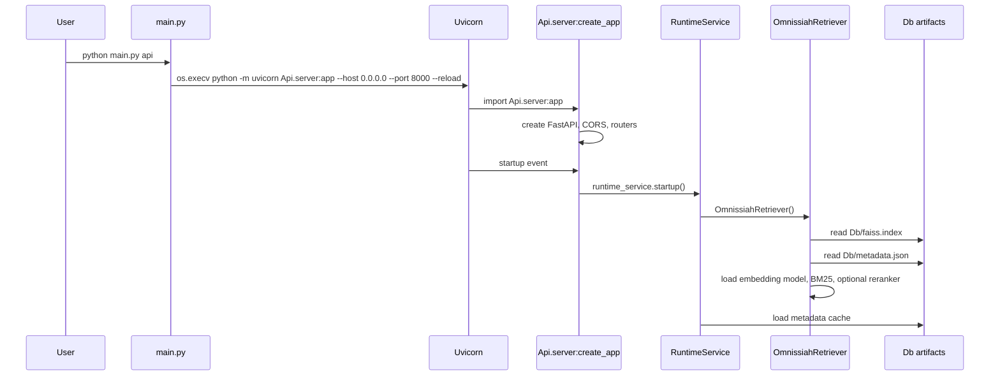
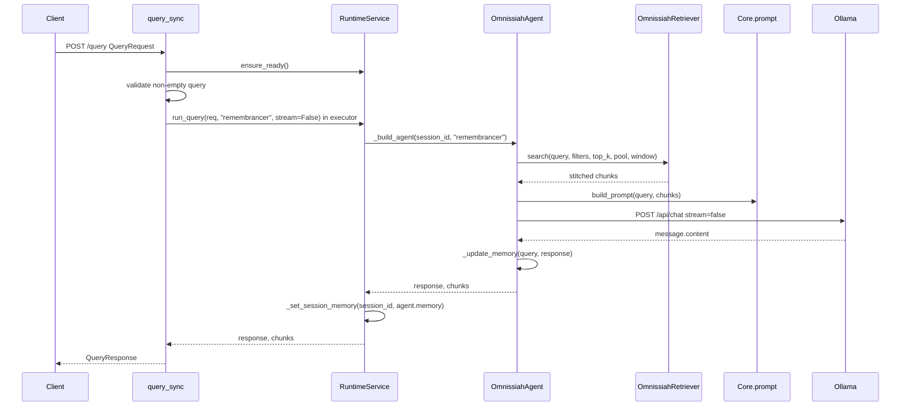
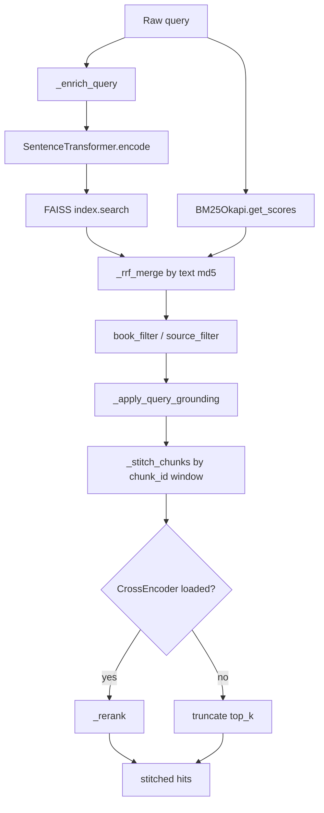
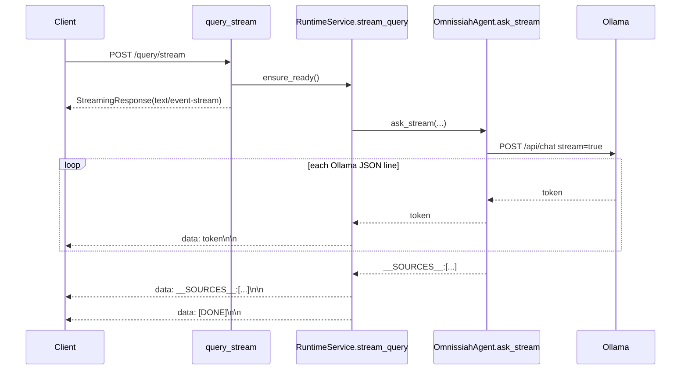

# Runtime Flow Documentation

## Startup Flow

Concrete call chain:

1. `main.py:31` validates the command name against `COMMANDS`.
2. `main.py:41` starts API mode with `os.execv(...)`, invoking `uvicorn` against `Api.server:app`.
3. `Api/server.py:25` builds the app with metadata from `Core.app_text.app_text`.
4. `Api/server.py:33` reads `OMNISSIAH_CORS_ORIGINS`; default is `"*"`.
5. `Api/server.py:47` registers the FastAPI startup event.
6. `Api/server.py:49` calls `runtime_service.startup()`.
7. `Api/services/runtime_service.py:44` constructs `OmnissiahRetriever`.
8. `Core/retriever.py:63` verifies `Db/faiss.index`; `Core/retriever.py:64` verifies `Db/metadata.json`.
9. `Core/retriever.py:65` reads the FAISS index.
10. `Core/retriever.py:68` reads `metadata.json` fully into memory.
11. `Core/retriever.py:79` loads the SentenceTransformer embedding model.
12. `Core/retriever.py:84` runs a dimension check against the FAISS index dimension.
13. `Core/retriever.py:96` builds a BM25 index if enabled and installed.
14. `Core/retriever.py:105` loads a CrossEncoder reranker if enabled and available.
15. `Api/services/runtime_service.py:46` loads a second metadata list into `_metadata_cache` for source/system APIs.

## Standard Query Flow: `POST /query`

Concrete route behavior:

- `Api/routes/query_routes.py:53` registers `POST /query` with `QueryResponse`.
- `Api/routes/query_routes.py:64` rejects blank queries with HTTP 400.
- `Api/routes/query_routes.py:67` invokes `runtime_service.run_query(req, mode="remembrancer", stream=False)` inside `_ollama_pool`.
- `_ollama_pool` is a `ThreadPoolExecutor(max_workers=4)` declared at `Api/routes/query_routes.py:12`, so blocking retrieval and Ollama HTTP calls do not block the async event loop.
- `Api/routes/query_routes.py:70` converts agent output to the response model.

## Retrieval Flow

Concrete retrieval stages in `Core/retriever.py`:

1. `search()` at `Core/retriever.py:118` applies request overrides or falls back to `retrieval_cfg`.
2. `_enrich_query()` at `Core/retriever.py:347` prepends the BGE search instruction.
3. `_faiss_search()` at `Core/retriever.py:185` embeds the query, normalizes according to config, searches FAISS, and returns chunk dicts containing `chunk_id`, `text`, `source`, `chapter`, `file_type`, `faiss_rank`, and `faiss_score`.
4. `_bm25_search()` at `Core/retriever.py:210` tokenizes with `query.lower().split()` and returns chunk dicts with `bm25_rank` and `bm25_score`.
5. `_rrf_merge()` at `Core/retriever.py:231` deduplicates by MD5 hash of text and scores candidates with `1/(rrf_k + rank)`.
6. `search()` applies `book_filter` as a case-insensitive substring over `source`, and `source_filter` as exact membership.
7. `_apply_query_grounding()` at `Core/retriever.py:261` extracts non-stopword query terms, expands configured variants, and boosts docs with matching source/chapter/text terms.
8. `_stitch_chunks()` at `Core/retriever.py:286` expands each selected hit around `chunk_id - window` through `chunk_id + window`, avoids duplicate neighbour IDs, joins text sections with blank lines, and annotates `stitch_range`.
9. `_rerank()` at `Core/retriever.py:321` scores query/document pairs with the CrossEncoder if configured.

## Prompt And Generation Flow

The agent owns prompt mode dispatch:

- `Core/agent.py:141` chooses the prompt builder based on `self.mode`.
- `mode="remembrancer"` calls `Core/prompt.py:105`, using `app_text.json:22`.
- `mode="narrator"` calls `Core/prompt.py:113`, using `app_text.json:29` and viewpoint hints from `Core/prompt.py:50`.
- `mode="explorer"` calls `Core/prompt.py:125`, using `app_text.json:23`.

Synchronous generation:

- `Core/agent.py:162` builds an Ollama payload with `model`, `stream=false`, `num_ctx`, `temperature`, and `top_p`.
- `Core/agent.py:175` posts to `ollama_cfg["url"]`.
- `Core/agent.py:180` returns `resp.json()["message"]["content"].strip()`.
- Connection, timeout, and generic errors are converted to string responses at `Core/agent.py:181`, `:183`, and `:185`.

Streaming generation:

- `Core/agent.py:194` builds the stream payload.
- `Core/agent.py:210` uses `requests.post(..., stream=True)`.
- `Core/agent.py:214` iterates line-delimited JSON from Ollama.
- `Core/agent.py:220` yields `data["message"]["content"]`.
- `Core/agent.py:222` stops when Ollama marks `done`.

## Streaming API Flow: `POST /query/stream`

The base streaming route is direct:

- `Api/routes/query_routes.py:85` registers `/query/stream`.
- `Api/routes/query_routes.py:99` returns `StreamingResponse(runtime_service.stream_query(req), media_type="text/event-stream")`.
- `Api/services/runtime_service.py:120` creates a remembrancer agent and iterates `agent.ask_stream(...)`.
- `Api/services/runtime_service.py:131` wraps regular tokens in SSE frames.
- `Api/services/runtime_service.py:138` writes updated session memory and yields `[DONE]`.

Narrator streaming uses an extra bridge:

- `Api/routes/query_routes.py:159` registers `/query/narrate/stream`.
- `Api/routes/query_routes.py:176` defines an async generator with an `asyncio.Queue`.
- `Api/routes/query_routes.py:180` starts a daemon thread that calls `runtime_service.stream_query_mode(req_narrator, mode="narrator")`.
- `Api/routes/query_routes.py:191` pushes errors into the queue as SSE error frames.
- `Api/routes/query_routes.py:205` drains queue items into the HTTP response.

## Inspect Flow: `POST /query/inspect`

`POST /query/inspect` is the non-generation debugging path:

1. `Api/routes/query_routes.py:36` registers the route.
2. `Api/routes/query_routes.py:47` runs `runtime_service.inspect_query(req)` in the executor.
3. `Api/services/runtime_service.py:143` calls `self._retriever.inspect(...)`.
4. `Core/retriever.py:151` runs FAISS, BM25, RRF, filtering, grounding, and stitching, but does not call Ollama.
5. `Api/services/runtime_service.py:153` sanitizes numpy scalars for JSON.
6. `Api/services/runtime_service.py:154` builds a prompt preview with `build_prompt()`.
7. The response includes retrieval internals plus a truncated system-prompt preview.

## Session Memory Lifecycle

- `Api.models.QueryRequest` defaults `session_id` to `"default"` at `Api/models.py:8`.
- `RuntimeService._session_memory` is initialized at `Api/services/runtime_service.py:36`.
- `RuntimeService._memory_lock` at `Api/services/runtime_service.py:37` protects only reads/writes to the memory map, not retrieval or Ollama inference.
- `RuntimeService._build_agent()` at `Api/services/runtime_service.py:64` snapshots memory into a new per-request `OmnissiahAgent`.
- `Core/agent.py:235` appends `{query, response}` after generation.
- `Core/agent.py:237` keeps only the last four turns.
- `Core/agent.py:240` formats previous turns into prompt text using `app_text["prompts"]["memory_intro"]`.
- `DELETE /memory` at `Api/routes/system_routes.py:40` calls `RuntimeService.clear_memory()`.
- `GET /memory` at `Api/routes/system_routes.py:45` calls `RuntimeService.get_memory()`.

Concurrent requests with the same `session_id` can race at semantic level: both requests snapshot the same old memory, then the later writer overwrites the session with its own agent memory. The lock prevents dictionary corruption but does not serialize per-session conversations.

## Cache Flow

There are three important caches/state holders:

1. Retriever-loaded index and metadata:
   - Created once per API startup in `RuntimeService.startup()` at `Api/services/runtime_service.py:44`.
   - Stored in `RuntimeService._retriever`.
   - Contains FAISS index, metadata list, BM25 object, embedding model, optional reranker.

2. Runtime metadata cache:
   - Loaded in `RuntimeService._load_metadata()` at `Api/services/runtime_service.py:50`.
   - Used by `/health`, `/info`, `/sources`, and `/sources/{source_name}`.
   - Does not auto-refresh if `Db/metadata.json` changes after startup.

3. Session memory cache:
   - In-memory process-local map at `Api/services/runtime_service.py:36`.
   - Cleared per session by route, or entirely lost on process restart/reload.

No persistent database, Redis, or distributed cache exists.

## Error Handling Paths

| Failure | Code path | Runtime effect |
|---|---|---|
| Malformed or missing `config.json` | `Core/config_loader.py:75`, `_fatal()` at `:17` | Prints fatal error and exits process. |
| Missing FAISS/metadata | `Core/retriever.py:357` | Raises `FileNotFoundError` with build/copy instructions during startup. |
| Embedding dimension mismatch | `Core/retriever.py:84` | Raises `RuntimeError`; startup fails. |
| Missing BM25 package | `Core/retriever.py:27` | Logs warning and disables sparse search. |
| Reranker load failure | `Core/retriever.py:109` | Logs warning and continues without reranker. |
| Blank query | Query routes at `Api/routes/query_routes.py:43`, `:64`, `:95`, `:140`, `:169`, `:246` | HTTP 400. |
| Ollama down | `Core/agent.py:181`, `Core/agent.py:224` | Returned/generated string error, not HTTP error. |
| Ollama timeout | `Core/agent.py:183`, `Core/agent.py:226` | Returned/generated string error. |
| Source listing failure | `Api/routes/system_routes.py:27`, `:35` | HTTP 500 with exception text. |
