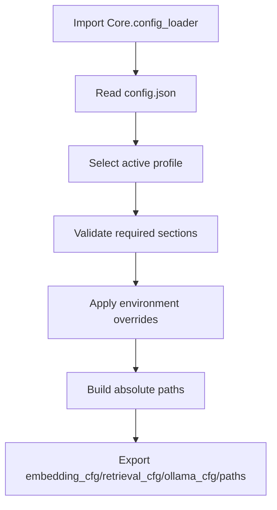
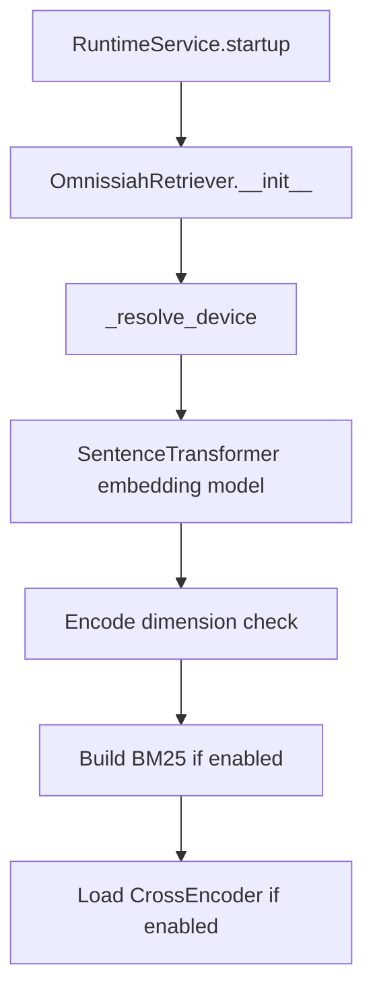
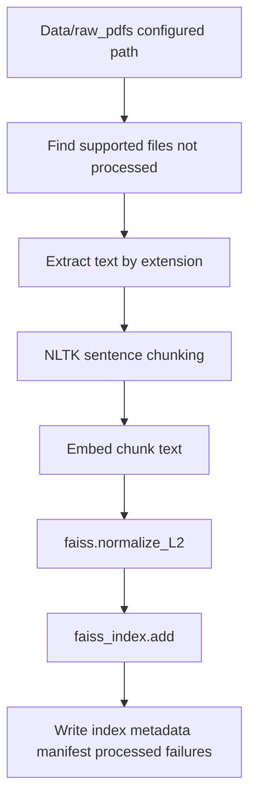

# Infrastructure Documentation

## Runtime Modes

The process dispatcher in `main.py:16` supports four modes:

| Command | Target | Purpose |
|---|---|---|
| `python main.py api` | `Api/server.py` through Uvicorn | Start FastAPI backend on port 8000. |
| `python main.py cli` | `Scripts/query_test.py` | Start local interactive query CLI. |
| `python main.py verify` | `Scripts/verify_db.py` | Validate FAISS/metadata health. |
| `python main.py build` | `Scripts/build_db.py` | Build or update the archive index. |

`main.py` uses `os.execv`, so the dispatcher process is replaced by the target process.

## Configuration Loading



Implementation:

- `Core/config_loader.py:10` computes project `BASE_DIR`.
- `Core/config_loader.py:11` sets `CONFIG_PATH`.
- `Core/config_loader.py:75` loads and validates the JSON.
- `Core/config_loader.py:85` uses `OMNISSIAH_ACTIVE_PROFILE` before falling back to `active_profile` in the file.
- `Core/config_loader.py:48` applies supported environment overrides.
- `Core/config_loader.py:126` builds absolute `paths`.

Supported environment overrides:

| Variable | Effect | Code |
|---|---|---|
| `OMNISSIAH_ACTIVE_PROFILE` | Selects profile. | `Core/config_loader.py:85` |
| `OMNISSIAH_MACHINE_ROLE` | Overrides `machine_role`. | `Core/config_loader.py:51` |
| `OMNISSIAH_EMBED_DEVICE` | Overrides embedding device. | `Core/config_loader.py:59` |
| `OMNISSIAH_OLLAMA_URL` | Overrides Ollama URL. | `Core/config_loader.py:60` |
| `OMNISSIAH_OLLAMA_MODEL` | Overrides Ollama model. | `Core/config_loader.py:61` |
| `OMNISSIAH_OLLAMA_NUM_CTX` | Overrides context window. | `Core/config_loader.py:62` |
| `OMNISSIAH_OLLAMA_TIMEOUT` | Overrides request timeout. | `Core/config_loader.py:63` |
| `OMNISSIAH_OLLAMA_TEMPERATURE` | Overrides generation temperature. | `Core/config_loader.py:64` |
| `OMNISSIAH_OLLAMA_TOP_P` | Overrides top-p. | `Core/config_loader.py:65` |
| `OMNISSIAH_TOP_K` | Overrides retrieval top-k. | `Core/config_loader.py:66` |
| `OMNISSIAH_CANDIDATE_POOL` | Overrides retrieval candidate pool. | `Core/config_loader.py:67` |
| `OMNISSIAH_STITCHING_WINDOW` | Overrides stitching window. | `Core/config_loader.py:69` |
| `OMNISSIAH_CORS_ORIGINS` | Controls FastAPI CORS origins. | `Api/server.py:33` |

## Profiles

### `lenovo_build`

Defined at `config.json:5`.

Purpose:

- High-memory build and query machine.
- Embedding model: `BAAI/bge-m3`.
- Retrieval: FAISS, BM25, CrossEncoder reranker.
- Ollama model: `qwen3:30b-a3b`.
- Larger retrieval pool and stitching window.

### `dell_query`

Defined at `config.json:48`.

Purpose:

- Lower-memory query-only machine.
- Embedding device forced to CPU.
- Reranker disabled.
- Smaller candidate pool and top-k.
- Ollama model: `llama3`.

## Required Runtime Artifacts

The API and CLI query paths require:

```text
Db/faiss.index
Db/metadata.json
config.json
app_text.json
```

`Core/retriever.py:357` fails fast if FAISS or metadata is missing, with instructions to run the builder or copy artifacts from the build machine.

Optional but used by system endpoints and verification:

```text
Db/manifest.json
Db/processed_files.json
Db/failed_files.json
Db/failure_report.json
```

## Model Loading Flow

### Query runtime model loading



Implementation:

- Device resolution at `Core/retriever.py:350`; `auto` uses CUDA if `torch.cuda.is_available()`.
- Embedding load at `Core/retriever.py:79`.
- Dimension probe at `Core/retriever.py:82`.
- BM25 build at `Core/retriever.py:96`.
- Reranker load at `Core/retriever.py:105`.

### Build-time model loading

`Scripts/build_db.py:106` attempts a separate build-time model path:

1. Checks local `bge_m3_onnx` directory.
2. Checks ONNX Runtime `CUDAExecutionProvider`.
3. Attempts `InferenceSession` against `bge_m3_onnx/model.onnx`.
4. Loads `ORTModelForFeatureExtraction` and `AutoTokenizer` if GPU path works.
5. Falls back to `SentenceTransformer(model_name, device="cpu", local_files_only=True)` at `Scripts/build_db.py:124`.

Build-time environment is forced offline by:

- `Scripts/build_db.py:25`: `TRANSFORMERS_OFFLINE=1`.
- `Scripts/build_db.py:26`: `HF_DATASETS_OFFLINE=1`.

## Database Build Flow



Supported extensions are selected in `Scripts/build_db.py:197`:

- `.pdf`
- `.epub`
- `.azw3`
- `.cbr`
- `.cbz`
- `.txt`

Extraction dispatch is in `Scripts/build_db.py:135`.

Windows external tools:

| Tool | Path constant | Used by |
|---|---|---|
| Poppler | `Scripts/build_db.py:18` | PDF-to-image OCR fallback. |
| Tesseract | `Scripts/build_db.py:19` | OCR text extraction. |
| 7-Zip | `Scripts/build_db.py:20` | CBR archive extraction. |
| Calibre `ebook-convert` | `Scripts/build_db.py:21` | AZW3 to EPUB conversion. |

Persistence contract:

- `Scripts/build_db.py:233` writes FAISS index.
- `Scripts/build_db.py:239` writes metadata, processed files, and manifest.
- `Scripts/build_db.py:244` merges and writes failure report.

## Cache Lifecycle

### Retriever cache

Loaded on API startup and kept until process restart:

- FAISS index object.
- Metadata list.
- `chunk_id` to metadata index map.
- SentenceTransformer embedder.
- BM25 object if enabled.
- CrossEncoder reranker if enabled.

Owner: `RuntimeService._retriever` at `Api/services/runtime_service.py:35`.

### Metadata API cache

Loaded on startup by `RuntimeService._load_metadata()` at `Api/services/runtime_service.py:50`.

Used by:

- `/health`
- `/info`
- `/sources`
- `/sources/{source_name}`

This cache does not refresh while the server is running. Rebuilds require an API restart to be visible.

### Session memory cache

Owner: `RuntimeService._session_memory` at `Api/services/runtime_service.py:36`.

Lifetime:

- Starts empty on process start.
- Updated after each query completes.
- Bounded to four turns per agent by `Core/agent.py:237`.
- Lost on reload or restart.

## Network Interfaces

Inbound:

- FastAPI HTTP on `0.0.0.0:8000` when launched through `main.py api`.
- Interactive stdin/stdout for CLI.

Outbound:

- Ollama HTTP `POST` to `ollama_cfg["url"]`, default `http://localhost:11434/api/chat`.
- Potential model downloads if SentenceTransformers cannot satisfy model locally in query runtime. Build script explicitly forces offline mode.

## CORS

`Api/server.py:33` reads `OMNISSIAH_CORS_ORIGINS`, comma-splits it, and defaults to `"*"`.

`allow_credentials` is `False` for wildcard origins and `True` otherwise, implemented at `Api/server.py:42`.

For a .NET or browser client with credentials, set:

```powershell
$env:OMNISSIAH_CORS_ORIGINS="http://localhost:5000,http://localhost:5173"
```

## Repository Hygiene

`.gitignore` excludes generated and local-heavy artifacts:

- `Db/faiss.index` at `.gitignore:6`.
- `Db/metadata.json` at `.gitignore:7`.
- Whole `Db/` at `.gitignore:8`.
- Raw and failed data folders at `.gitignore:14` and `.gitignore:15`.
- Virtual environments at `.gitignore:28` and `.gitignore:29`.

Observed local issue: ignored files are present in the workspace, and `.venv` is checked in locally. Do not rely on recursive file scans without excluding `.venv`, `.git`, large zip files, and generated DB files.

## Verification And Operations

Use:

```text
python main.py verify
```

or:

```text
python Scripts/verify_db.py
```

Checks performed by `Scripts/verify_db.py`:

- Required DB file existence.
- FAISS vector count and dimension.
- Metadata count.
- Vector count equals metadata count.
- Embedding model output dimension equals FAISS dimension.
- Chunk ID continuity.
- Source and file type distribution.
- Sample chunk readability.
- Failed-file log.
- Manifest contents.

## Production Hardening Recommendations

These are inferred from concrete code paths:

- Disable `--reload` in production by changing `main.py:41`.
- Convert `RuntimeService.ensure_ready()` failures into HTTP 503 in query routes.
- Remove or reconcile duplicate `Api/routes/QUERY_ROUTES_IMPORVED.py`.
- Add explicit `chunk_id`, `chapter`, and `file_type` in `Scripts/build_db.py:180` output so API metadata matches runtime expectations.
- Add a real `--retry-failed` argument parser if retry remains documented.
- Avoid loading metadata twice by letting source APIs read from the retriever metadata or by documenting the memory cost.
- Add per-session locks if multiple clients will issue concurrent requests with the same `session_id`.
