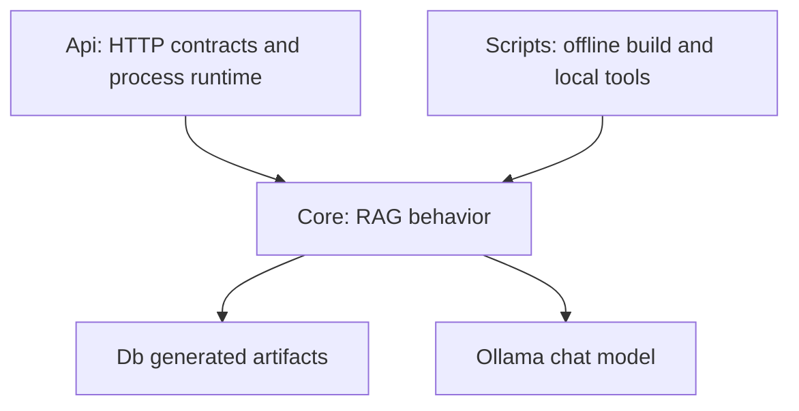

# Contributor And AI Agent Guide

## Development Mental Model

OmnissiahCore has three layers:



Keep changes in the correct layer:

- API changes belong in `Api/models.py`, `Api/routes/*`, or `Api/services/runtime_service.py`.
- Retrieval behavior belongs in `Core/retriever.py`.
- Prompt behavior belongs in `app_text.json` and `Core/prompt.py`.
- Ollama call behavior belongs in `Core/agent.py`.
- Ingestion/build behavior belongs in `Scripts/build_db.py`.
- Runtime settings belong in `config.json` and `Core/config_loader.py`.

## Before Making Changes

1. Check which runtime path is affected: API, CLI, build, or verification.
2. Read the files that form the call chain, not just the file you plan to edit.
3. Treat `Db/*`, `Data/*`, `.venv/*`, `OmnissiahCore.zip`, and `bge_m3_onnx/model.onnx_data` as large local artifacts.
4. Do not rewrite prompts casually; `app_text.json` is behavioral logic.
5. Do not assume `chapter`, `file_type`, or `chunk_id` always exist in metadata. The builder currently writes only `text` and `source` for chunks at `Scripts/build_db.py:192`.

## Common Change Recipes

### Add a new query mode

Files to update:

- Add prompt text in `app_text.json`.
- Add a prompt builder in `Core/prompt.py`.
- Extend `OmnissiahAgent._build_prompt()` at `Core/agent.py:141`.
- Add a route in `Api/routes/query_routes.py` if the mode needs a public endpoint.
- Add docs in `docs/architecture/02_API_SERVICE_CONTRACTS.md`.

Do not add a `mode` request field unless you intentionally redesign the public API. Current mode selection is route-based.

### Change retrieval defaults

Files to update:

- `config.json` profile retrieval sections.
- Possibly `Core/config_loader.py` if adding a new config key.
- `Core/retriever.py` only if changing algorithmic behavior.

Validate with:

- `POST /query/inspect` before and after.
- `Scripts/verify_db.py` if model or index assumptions changed.

### Add a new input file type

Files to update:

- `Scripts/build_db.py:135` for extraction dispatch.
- `Scripts/build_db.py:197` for discovery extension list.
- `requirements.txt` for any new parser dependencies.
- Documentation in `docs/architecture/04_INFRASTRUCTURE.md`.

Preserve the generated metadata contract expected by `Core/retriever.py:_faiss_search()`: at minimum `text` and `source`; preferably explicit `chunk_id`, `chapter`, and `file_type`.

### Add a .NET client

Use HTTP only. Do not read `Db/faiss.index` or `Db/metadata.json` from .NET.

Recommended sequence:

1. `GET /health`.
2. `GET /config/runtime`.
3. `POST /query/inspect` for diagnostics.
4. `POST /query`, `/query/narrate`, or `/query/explore`.
5. Use SSE endpoints only if the .NET client has robust stream parsing and duplicate `[DONE]` tolerance for narrator streaming.

## Runtime Contracts To Preserve

### Chunk dict contract

Downstream code expects chunk dictionaries to tolerate missing fields, but these keys are used:

- `text`: required for prompt context.
- `source`: displayed in source lists and source filtering.
- `chapter`: displayed, defaults to `"unknown"`.
- `file_type`: displayed in prompt headers, defaults to `"pdf"`.
- `chunk_id`: used for stitching; fallback behavior exists but explicit IDs are safer.
- Score fields: `rerank_score`, `query_overlap_score`, `rrf_score`, `faiss_score`.
- `stitch_range`: displayed in source lists.

### SSE contract

Streaming clients should parse lines that begin with `data: ` and handle:

- Ordinary token text.
- `__SOURCES__:` JSON payload.
- `[DONE]`.
- `[ERROR] ...`.

### Memory contract

Session memory is:

- keyed by `session_id`;
- process-local;
- last four turns only;
- not persisted;
- not safe for strict concurrent turn ordering.

## Known Defects And Mismatches

These are not speculative; each is grounded in current files.

| Issue | Evidence | Impact |
|---|---|---|
| Duplicate query route file | `Api/routes/QUERY_ROUTES_IMPORVED.py` duplicates `Api/routes/query_routes.py`; server imports only `query_routes.py`. | Fixes can drift. |
| Test narrator mode mismatch | `Tests/test.py:249` posts `"mode": "narrator"` to `/query`; `Api.models.QueryRequest` has no mode field; `/query` passes `mode="remembrancer"`. | Test does not actually verify narrator mode. |
| Streaming narrator duplicate done | `RuntimeService.stream_query_mode()` yields `[DONE]`; route `_stream()` also yields `[DONE]`. | SSE clients may see two completion events. |
| Builder missing chunk metadata | `Scripts/build_db.py:192` returns only `text` and `source`; retriever exposes `chunk_id`, `chapter`, and `file_type` with fallbacks. | Stitching and source metadata are weaker than API suggests. |
| Retry flag missing | Docs and verification mention retry; `Scripts/build_db.py:256` ignores argv. | Operators may believe failed-file retry exists when it does not. |
| Build save can write `None` index | `Scripts/build_db.py:203` calls `self.save({})` when no files to process; `save()` writes `self.faiss_index`. | Fresh empty build can fail. |
| API startup loads metadata twice | `Core/retriever.py:68` and `Api/services/runtime_service.py:50`. | Higher memory footprint. |

## Testing Guide

### API smoke test

Start API:

```text
python main.py api
```

Then call:

```text
GET http://localhost:8000/health
GET http://localhost:8000/info
POST http://localhost:8000/query/inspect
```

Use `/query/inspect` before `/query` when modifying retrieval or prompts, because inspect does not call Ollama.

### Existing integration test harness

Run:

```text
python Tests/test.py
```

Limitations:

- Requires API server already running.
- Includes long Ollama tests with `TIMEOUT = 3600`.
- Narrator tests currently hit remembrancer endpoints.

### Verification script

Run:

```text
python main.py verify
```

Use this after copying `Db` artifacts between machines or rebuilding the index.

## Extension Points

Safe extension points:

- New API routes that call `RuntimeService` methods.
- New prompt modes through `Core/agent.py:_build_prompt()`.
- New retrieval scoring steps inside `Core/retriever.py:search()` after RRF and before stitching.
- New source metadata fields in builder output, as long as existing fields remain.
- New system diagnostics in `RuntimeService.info_payload()`.

High-risk extension points:

- Changing embedding model without rebuilding FAISS. `Core/retriever.py:84` will reject dimension mismatches, but same-dimension semantic mismatches can still degrade results.
- Changing chunking without rebuilding metadata and FAISS together.
- Changing `chunk_id` semantics. Stitching depends on neighbouring IDs in `Core/retriever.py:286`.
- Making session memory persistent without considering prompt length and privacy.
- Adding async HTTP clients inside agent without adjusting route executor/threading behavior.

## File Ownership Responsibilities

| File | Primary owner mindset |
|---|---|
| `Api/server.py` | Application composition only; avoid business logic here. |
| `Api/models.py` | Public schema changes; coordinate with clients. |
| `Api/routes/query_routes.py` | HTTP behavior and response shaping; avoid retrieval algorithm edits here. |
| `Api/routes/system_routes.py` | Operational endpoints and diagnostics. |
| `Api/services/runtime_service.py` | API service orchestration, runtime lifecycle, memory ownership. |
| `Core/config_loader.py` | Config contract and environment override compatibility. |
| `Core/retriever.py` | Retrieval quality, ranking, model/index assumptions. |
| `Core/agent.py` | LLM orchestration, Ollama API behavior, memory formatting. |
| `Core/prompt.py` | Context formatting and prompt-builder mechanics. |
| `app_text.json` | Prompt and displayed text policy. |
| `Scripts/build_db.py` | Offline ingestion, embedding, and persistence. |
| `Scripts/verify_db.py` | Artifact health checks. |
| `Tests/test.py` | End-to-end HTTP smoke and scenario tests. |

## Recommended Next Refactors

1. Delete or archive `Api/routes/QUERY_ROUTES_IMPORVED.py`.
2. Add explicit metadata fields in `Scripts/build_db.py:chunk_text()`: `chunk_id`, `source`, `chapter`, `file_type`.
3. Fix `Tests/test.py` to use `/query/narrate` and `/query/narrate/stream`.
4. Remove duplicate `[DONE]` from narrator streaming.
5. Add an API-level exception handler or route try/except around `ensure_ready()`.
6. Add command-line parsing to `Scripts/build_db.py` for `--retry-failed` or remove the documented flag.
7. Consider a metadata-cache reuse strategy to avoid double-loading `metadata.json`.
